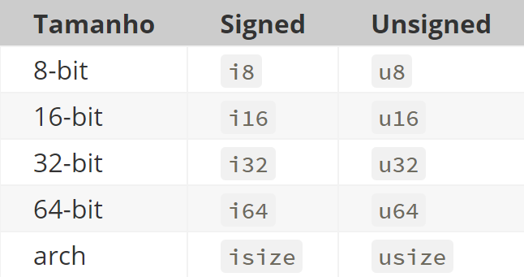
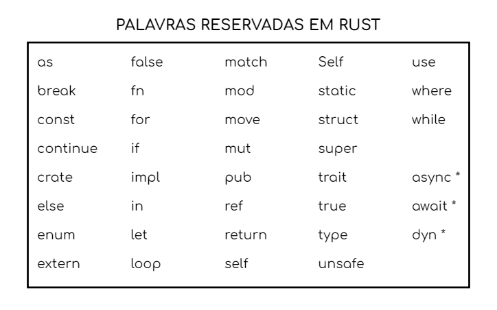

# Construtores

## Variáveis e Mutabilidade
Em Rust, as variáveis são imutáveis por padrão. Isso permite que o código seja mais seguro. Porém, o desenvolvedor pode declarar as variáveis como mutáveis, explicitamente, caso deseje.
```rust
fn main () {
  let x = 5; // variável imutável
  println!("O valor de x é: {}", x);
  let mut y = 10; // variável mutável
  y = 20; // Se tentarmos aplicar essa operação em x, teremos o erro: "cannot assign twice to immutable variable"
  println!("O valor de y é: {}", y);
}
```

## Tipos primitivos
Rust possui um rico sistema de tipos primitivos, que são verificados em tempo de compilação. Estes tipos podem ser declarados explicitamente ou inferidos pelo compilador. Alguns deles, são:

* Inteiro : Em Rust, os inteiros (int) podem, em sua declaração, indicar o valor associado com base em seu tamanho. Além disso, pode ser declarado como signed (positivos e negativos) ou unsigned (apenas positivos).

<p align="left">
  
</p>

* Flutuante: Números com casas decimais. Possui dois tipos primitivos que podem ser utilizados: f32 (32 bits) e f64 (64 bits)

* Booleano: Indica verdadeiro ou falso.

* Caractere: O char é o tipo mais primitivo da linguagem. Referenciado por aspas simples.

## Tipos compostos

* Tuplas: Forma de agrupar vários valores de tipos diferentes em uma só variável

```rust
fn main () {
  let tupla: (f32, f64, u8) = (30.0, 3.5, 1); // a tupla pode armazenar diferentes tipos primitivos
 
  let (a, b, c) = tupla; // com esse método, atribuímos a,b e c aos valores da tupla
}
```

* Matriz: Forma de ter vários valores em uma coleção com tipo único.

```rust
fn main () {
    let matriz = [1, 2, 3, 4, 5]; // os dados devem ser do mesmo tipo

    let primeiro = matriz[0]; // acesso a valores da matriz
}
```
## Operadores
Rust oferece operadores relacionais, lógicos e aritméticos, similares aos de outras linguagens como C, C++ e Java:

* Relacionais: ==, !=, >, <, >=, <=
* Lógicos: &&, ||, !
* Aritméticos: +, -, *, /, %

## Comandos
Os comandos de controle de fluxo em Rust são semelhantes aos de C e Java, incluindo:

* Condicionais: if, else, else if
* Iteração: for, while, loop
* Controle de fluxo: break, continue, return, match

## Palavras reservadas
Palavras que podem ser utilizadas apenas em seu contexto correto. Não podem ser utilizadas como nomes de itens, variáveis, parâmetros e etc.


<p align="left">
  
</p>


Além destas palavras, ainda temos, em Rust, a presença de outras palavras reservadas. Estas, especificamenteme, ainda não tem seu uso definido pela linguagem, mas estão reservadas para uso futuro. São elas: abstract, become, box, do, final, macro, override, priv, typeof, unsized, virtual, yield.

## Modificadores de acesso
Por padrão, a visibilidade de declarações em Rust é privada. Para torná-la pública, o desenvolvedor deve utilizar a palavra-chave "pub", identificando o escopo em que deseja que a variável ou método seja público. As regras para isso são:
* pub(in path): faz o item visível dentro do path fornecido. path deve ser um módulo ancestral deste item
* pub(crate): torna o item visível dentro da caixa atual
* pub(super): torna o item visível para o módulo pai. Equivale a pub(in super).
* pub(self): torna o item visível para o módulo atual. Equivale a pub(in self).

```rust
struct PrivateStruct { // declaração padrão -> privado
    field: i32,
}

pub struct PublicStruct { // declaração alterada para pública
    pub field: i32,
}
```
## Tratamento de Erros
Rust adota um modelo de tratamento de erros que, em comparação com outras linguagens, é distinto e rigoroso. Em vez de usar exceções, Rust utiliza enums e tipos de retorno específicos para garantir que todos os erros possíveis sejam tratados de forma explícita.

Em Rust, não há null nem exceptions e separa os erros em duas categorias:
* Recuperável: programa consegue tratar e continuar funcionando. Sempre que ocorre, ele pode ser retornado pela função de onde ocorreu. Funções com erros recuperáveis retornam uma enumeração Result <T,E>, em que T é o tipo do retorno em caso de sucesso, e E em caso de fracasso. 
* Irrecuperável: o programa não consegue tratar e deve encerrar sua execução imediatamente.

A verificação de erros em Rust é fortemente incentivada por meio do uso do operador match, que permite ao desenvolvedor lidar de maneira abrangente com os resultados:

```rust
match divide(10.0, 2.0) {
  Ok(resultado) => println!("Resultado: {}", resultado),
  Err(erro) => println!("Erro: {}", erro),
}
```

Dessa forma, a linguagem de programação garante que os desenvolvedores considerem todas as possíveis situações de erro.