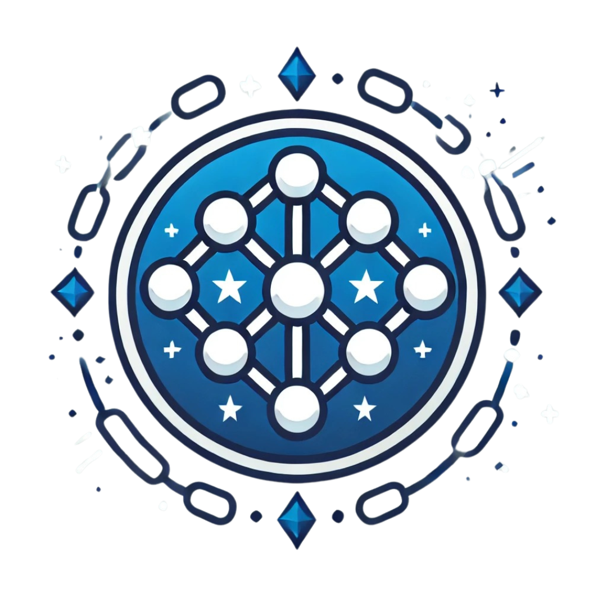

# Wiki do Projeto

## Integrantes

- Bruno Berto de Oliveira Ribeiro (200061089)
- Isaque Augusto da Silva Santos (190089245)
- Moises de Araújo Altounian (200069306)
- Pedro Cesar Ribeiro Passos (180139312)
- Tiago Cabral de Faria (160146712)

<table style="margin-left: auto; margin-right: auto;">
    <tr>
        <td align="center">
            <a href="https://github.com/AngryLeaderBB">
                
                <h5 class="text-center">Bruno Berto de Oliveira Ribeiro</h5>
            </a>
        </td>
        <td align="center">
            <a href="https://github.com/seraphritt">
                
                <h5 class="text-center">Isaque Augusto da Silva Santos</h5>
            </a>
        </td>
        <td align="center">
            <a href="https://github.com/ogmoises">
                
                <h5 class="text-center">Moises de Araújo Altounian</h5>
            </a>
        </td>
        </td>
        <td align="center">
            <a href="https://github.com/pedrocrp">
                
                <h5 class="text-center">Pedro Cesar Ribeiro Passos</h5>
            </a>
        </td>
        <td align="center">
            <a href="https://github.com/tiag0cabral">
                
                <h5 class="text-center">Tiago Cabral de Faria</h5>
            </a>
        </td>
    </tr>
</table>

## Sobre o Projeto

Este projeto envolve a criação e implementação de uma criptomoeda utilizando <i>blockchain</i> em Rust. A *blockchain* serve como o histórico para todas as transações efetuadas pelos usuários da criptomoeda, garantindo segurança e imutabilidade dos dados transacionais.

A linguagem foi selecionada devido às suas características em termos de segurança, eficiência de concorrência e alto desempenho.

  

